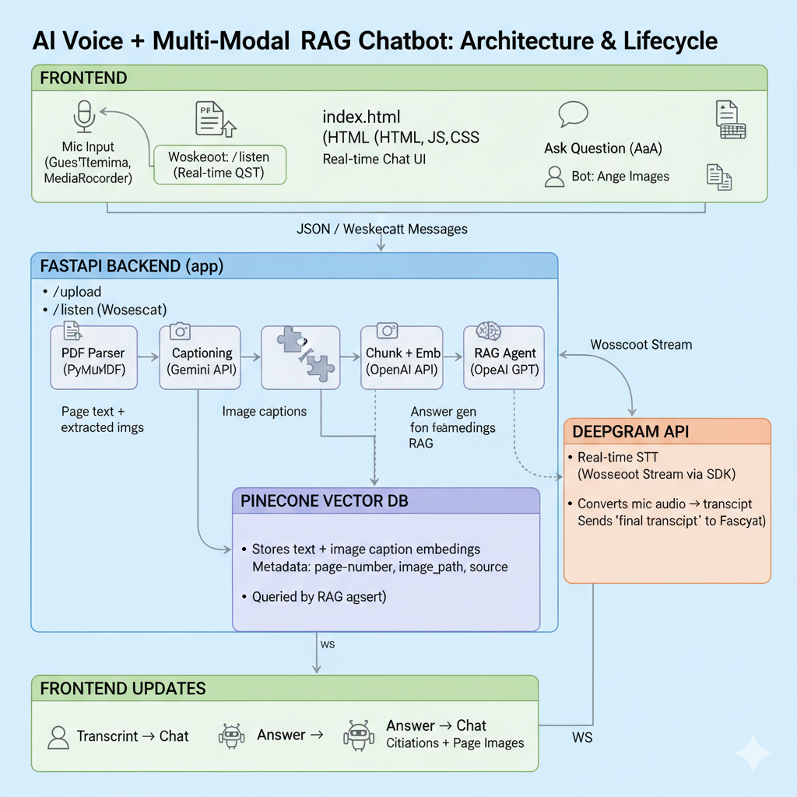

# Multi-Modal Agentic RAG Chatbot

This project is a voice-enabled Retrieval-Augmented Generation (RAG) chatbot.

It's designed to provide a comprehensive Q&A experience by ingesting multi-modal documents (PDFs with text and images), using an agentic LLM router to decide between searching the document or the open web, and providing a real-time voice interface for interaction.

---

## Features

* **Multi-Modal PDF Ingestion**: Upload PDFs to automatically extract all text, embedded images, and create page-by-page visual snapshots.
* **Image Captioning**: Uses Google Gemini to generate descriptive captions for all extracted images, making visual content searchable.
* **Multi-Vector RAG**: Stores both text chunks and image captions as vectors in a Pinecone database for a comprehensive, multi-modal search.
* **Agentic Router**: Uses a GPT-4o agent to intelligently route user queries to the correct tool: `pinecone_search` for document-specific questions or `web_search` (via Google Serper) for general knowledge.
* **Real-time Voice Interface**: Stream audio directly from the browser via WebSockets. Get transcribed text and RAG answers in real-time using Deepgram's streaming STT.
* **Visual Citations**: The frontend displays answers with clear citations, including page numbers and snapshot images of the source page for easy verification.

---

## Architecture & Data Flow



The system operates in two main flows:

### Flow 1: Document Ingestion (`POST /upload`)

1.  A user uploads a PDF file via the web interface.
2.  The `pdf_extractor` (using PyMuPDF) parses the file, extracting all text, embedded images, and saving a `.png` snapshot of each page to the `static/` directory.
3.  The extracted images are sent to the `image_captioning` module, which uses the **Google Gemini API** to generate descriptive captions.
4.  The raw text is processed by the `semantic_chunker` (using LangChain) into manageable chunks.
5.  The `pinecone_utils` module embeds both the text chunks and the image captions using the **OpenAI embedding API**.
6.  Finally, all vectors (for text and captions) are upserted into the **Pinecone** index with rich metadata, including page numbers, source filename, and the path to the page's snapshot image.

### Flow 2: Answering a Query (`POST /ask` or `WS /listen`)

1.  The user either types a question or speaks into the microphone.
2.  **Voice:** The browser streams audio to the `WS /listen` endpoint. **Deepgram** transcribes the audio in real-time. When a final transcript is ready, the process continues.
3.  **Text/Voice Transcript:** The query is sent to the `agent_rag.run_rag_agent`.
4.  **Router:** The agent's `router` (a GPT-4o call) first decides if the query is best answered by the document (`pinecone_search`) or the open web (`web_search`).
5.  **Tool Use:**
    * **`pinecone_search`**: The query is embedded, and Pinecone is searched to find relevant text chunks or image captions.
    * **`web_search`**: The **Google Serper API** is called for general knowledge questions.
6.  **Synthesize:** The retrieved context (from Pinecone or the web) is passed to the `answer_synthesizer` (another GPT-4o call), which generates a natural language answer.
7.  **Response:** The final answer and its citations (page numbers, image paths, or web URLs) are sent back to the frontend and displayed to the user.

---

## Tech Stack

| Category | Technology | Purpose |
| :--- | :--- | :--- |
| **Backend** | FastAPI, Uvicorn | High-performance async web server & API. |
| **Frontend** | HTML, CSS, Vanilla JS | Simple, responsive UI with WebSocket client. |
| **Database** | Pinecone | Vector database for multi-modal RAG. |
| **AI / LLMs** | OpenAI (GPT-4o) | Agentic router & answer synthesis. |
| | OpenAI (text-embedding-3-small) | Embedding text and captions. |
| | Google Gemini (Flash) | Image captioning. |
| **Services** | Deepgram | Real-time streaming speech-to-text. |
| | Google Serper | Low-latency web search API. |
| **Python Libs** | PyMuPDF (fitz) | PDF text and image extraction. |
| | LangChain | Semantic text splitting. |
| | httpx, aiohttp | Async HTTP requests for external APIs. |

---

## Setup and Installation

1.  **Clone the repository:**
    ```bash
    git clone <your-repository-url>
    cd <repository-name>
    ```

2.  **Create and activate a virtual environment:**
    ```bash
    python -m venv venv
    source venv/bin/activate  # On Windows: venv\Scripts\activate
    ```

3.  **Install the required dependencies:**
    ```bash
    pip install -r requirements.txt
    ```

4.  **Set up environment variables:**
    Copy the `.example.env` file to a new file named `.env` and fill in all the required API keys.

    ```bash
    cp .example.env .env
    nano .env  # Or use your preferred editor
    ```

5.  **Run the FastAPI server:**
    The server is configured in `index.html` to run on port 8002.
    ```bash
    uvicorn main:app --host 0.0.0.0 --port 8002 --reload
    ```

6.  **Open the application:**
    Open `http://localhost:8002` in your web browser.

---

## Environment Variables (.env)

You must create a `.env` file and populate it with the following keys for the application to function:

| Variable | Description |
| :--- | :--- |
| `OPENAI_API_KEY` | Required for the GPT-4o agent and `text-embedding-3-small`. |
| `PINECONE_API_KEY` | API key for your Pinecone project. |
| `PINECONE_HOST` | Host URL for your Pinecone index (e.g., `https://...`). |
| `PINECONE_INDEX_NAME` | The name of your Pinecone index. |
| `SERPER_API_KEY` | API key for Google Serper (web search tool). |
| `DEEPGRAM_API_KEY` | API key for Deepgram (real-time STT). |
| `GEMINI_API_KEY` | API key for Google AI Studio (for Gemini image captioning). |

---

## File Structure
 ``` 
  ├── main.py # FastAPI server (endpoints: /upload, /ask, /listen) 
  ├── index.html # Single-page frontend 
  ├── requirements.txt # Python dependencies 
  ├── .example.env # API key template 
  ├── utils/ │ ├── agent_rag.py # Core RAG agent (router, tools, synthesizer) │ 
               ├── pdf_extractor.py # Extracts text, images, and page snapshots │ 
               ├── image_captioning.py # Uses Gemini to caption images │ 
               ├── embeddings.py # OpenAI embedding function │ 
               ├── pinecone_utils.py # Upserts text/caption vectors to Pinecone │ 
               └── semantic_chunker.py # Splits text into chunks 
  └── static/ # (Created automatically) For page snapshots & other assets
```
##  API Endpoints

The `main.py` file serves the application using FastAPI. Here are the primary endpoints:

* **`GET /`**:
    * Serves the main `index.html` frontend to the user.

* **`POST /upload`**
    * **Description**: Handles multi-part file uploads for PDFs.
    * **Action**: Triggers the entire ingestion pipeline: text/image extraction, page snapshotting, image captioning, embedding, and upserting to Pinecone.
    * **Returns**: A JSON summary of the processed document (e.g., page count, image count, chunk count).

* **`POST /ask`**
    * **Description**: Accepts a plain text query from the user.
    * **Action**: Runs the full RAG agent: routes the query (to Pinecone or web), gets context, synthesizes an answer.
    * **Returns**: A JSON object containing the `answer` and `citations`.

* **`WS /listen`**
    * **Description**: A WebSocket endpoint for real-time, bi-directional audio streaming.
    * **Action**:
        1.  Receives audio chunks from the browser.
        2.  Forwards the audio to the Deepgram streaming API.
        3.  Receives transcripts from Deepgram.
        4.  When a **final transcript** is received, it triggers the `run_rag_agent`.
        5.  Streams back JSON messages to the client with `{"type": "transcript", ...}` or `{"type": "rag_answer", ...}`.

---

## Core Modules (utils/)

The `utils/` directory contains all the specialized logic, separated by concern.

* **`agent_rag.py`**: This is the "brain" of the chatbot.
    * **Router**: Decides whether a query should be answered by `pinecone_search` (for documents) or `web_search` (for general info).
    * **Tools**: Contains the `pinecone_search` and `web_search` (Google Serper) functions.
    * **Synthesizer**: Takes the context from the tools and the user's query to generate a final, human-readable answer using GPT-4o.

* **`pdf_extractor.py`**: Handles all PDF processing.
    * Uses `PyMuPDF` (fitz) to open the document.
    * Extracts raw text from each page.
    * Extracts embedded images (e.g., charts, photos) from each page.
    * Saves a separate `.png` snapshot of *each page* to `static/pdf_pages/` for visual citations.

* **`image_captioning.py`**: Creates text descriptions for images.
    * Takes the extracted image bytes from the PDF.
    * Sends them to the **Google Gemini API** to generate brief, descriptive captions.

* **`embeddings.py`**: A dedicated, async-friendly module for creating vector embeddings.
    * Uses the **OpenAI `text-embedding-3-small`** model.
    * Provides a batch-processing function `get_openai_embeddings_batch` for efficiency.

* **`pinecone_utils.py`**: Manages all communication with the Pinecone vector database.
    * Embeds both text chunks and image captions using the `embeddings.py` module.
    * Upserts the vectors into Pinecone with rich metadata (page number, source file, image path, etc.) to enable powerful, cited search.

* **`semantic_chunker.py`**: Prepares text for embedding.
    * Uses `langchain_text_splitters` to break down long pages of text into smaller, semantically coherent chunks that fit within the embedding model's context window.

---

## License

This project is open-source and available under the MIT License.